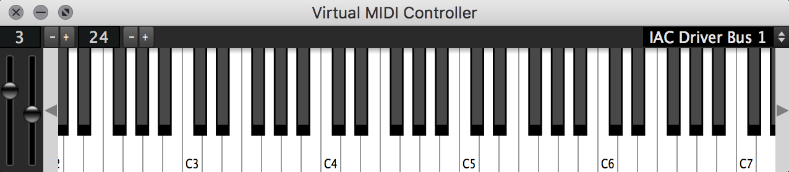

# Virtual MIDI Controller


A software MIDI controller which can send MIDI to any input device.  Also exposes itself as a MIDI input to other applications (OSX only)

## Building with CMake
This project uses CMake as its build system. You'll need CMake 3.22 or later.

### Prerequisites
- CMake 3.22 or later
- A C++17 compatible compiler

### Build Steps
1. Initialize submodules:
   ```
   git submodule update --init --recursive
   ```

2. Create a build directory and configure:
   ```
   mkdir build
   cd build
   cmake ..
   ```

3. Build the project:
   ```
   cmake --build .
   ```

## VSCode Support
There are launch and build tasks in the `.vscode` folder, though these may need updating to use CMake instead of the previous build system.
